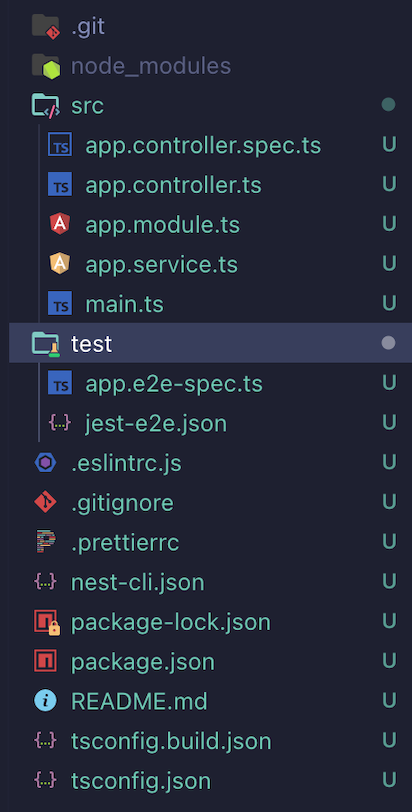
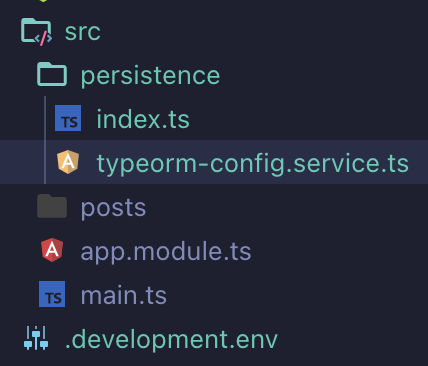
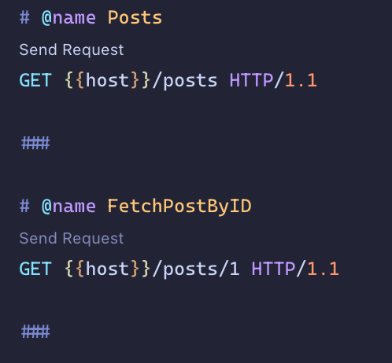

# NestJS - Building an api with NestJS (For beginners)

In this tutorial we will learn how to create a REST api that performs crud operations using TypeORM and postgresql. We will cover how to setup TypeORM, creating entities, repositories and use in our services to fetch data and integrate with our controllers.

## Introduction

NestJS is a framework for building server sider applications using nodejs. It gives us the flexibility to choose ExpressJS or Fastify as the underlying library for it. It also comes with a cli which helps creating new project, module, service etc. Its also has full typescript support and gives us a opinionated way of structuring our applications that scale very well. we will see in action by creating a simple crud api from scratch.

## Prerequesties

Basic knowledge about nodejs, rest api. npm, nodejs, postgresql installed in a machine.

## Creating a new project

First we need to install nest-cli using `npm i -g @nestjs/cli`. After that create new project by running `nest new <project name>`. we will call our project as blog-api. Navigate to the desired location and run 

```shell
nest new blog-api
```

Now we get the following folder structure.



The `main.ts` file is our entry point and it has

```typescript
import { NestFactory } from '@nestjs/core';
import { AppModule } from './app.module';

async function bootstrap() {
  const app = await NestFactory.create(AppModule);
  await app.listen(3000);
}

bootstrap();
```

`AppModule` is imported and passed to the create method. Inside `AppModule` we see

```typescript
import { Module } from '@nestjs/common';
import { AppController } from './app.controller';
import { AppService } from './app.service';

@Module({
  imports: [],
  controllers: [AppController],
  providers: [AppService],
})
export class AppModule {}
```

controllers, services are added in the `Module` decorator. So basically all our app metadata is being passed to this `AppModule` and passed to the `NestFactory.create` method which gives an app instance for us.

Now run the project using `npm run start:dev`. Hit http://localhost:3000 in browser. Now we will see `Hello World!`. Press CTRL + C in terminal to quit the app from running.

We can delete some default files/folders that we are not interested in. Delete `test`, `.git` folders, `app.controller.spec.ts`, `app.controller.ts`, `app.service.ts` files. Now if we run our application it will no longer work. Since we deleted few files that's there in the `AppModule` as dependencies. To fix that update the `app.module.ts` with the following

```typescript
import { Module } from '@nestjs/common';

@Module({
  imports: [],
  controllers: [],
  providers: [],
})
export class AppModule {}
```
Now if we run we won't any errors in the terminal but we will see

```json
{"statusCode":404,"message":"Cannot GET /","error":"Not Found"}
```

in the browser if we hit `http://localhost:3000`. That's because we don't have any route attached to our app. We will add one shortly.

## Creating posts resource

We can create all the necessary files and folders on our own or we can use cli to generate the scaffold for us. In this tutorial we will see how to create one using the cli. Resource means controllers, services, dtos, entities required for a module. To generate post resource run

```shell
nest g resource posts --no-spec
```

It will ask the following questions

`What transport layer do you use?`  - select `REST API` 

`Would you like to generate CRUD entry points?` - type `Y` and then hit enter. 

Now there are lot of files got generated inside the folder `posts` for us. We will go through each of them when we work on those files. If we navigate to `update-post.dto.ts` we see a package `@nestjs/mapped-types` is used and we didn't install that earlier. So install that by running

```shell
npm add @nestjs/mapped-types
```

Now run the project and navigate to http://localhost:3000/posts and we will see **This action returns all posts** in the browser.

## Setting typeorm with postgresql

Lets install the dependencies first by running

```shell
npm install --save typeorm pg @nestjs/typeorm @nestjs/config
```

Create a `.development.env` file in the project root and add the following

```
DB=blog-api
DB_HOST=localhost
DB_PORT=5432
DB_USERNAME=<username here>
DB_PASSWORD=<password here>
DB_SYNCHRONIZE=true
DB_LOGGING=true
DB_AUTOLOADENTITIES=true
```

In real world scenario we can choose not to add password here. We can set a environment variable with `DB_PASSWORD` in the terminal where we are running the application.

After that create a database named `blog-api` in the postgreql. Now lets create a typeorm config file in the location as shown below



In the `typeorm-config.service.ts` add the following

```typescript
import { Injectable } from '@nestjs/common';
import { ConfigService } from '@nestjs/config';
import { TypeOrmModuleOptions, TypeOrmOptionsFactory } from '@nestjs/typeorm';

@Injectable()
export class TypeOrmConfigService implements TypeOrmOptionsFactory {
  constructor(private _configService: ConfigService) {}

  createTypeOrmOptions(): TypeOrmModuleOptions {
    return {
      type: 'postgres',
      host: this._configService.get('DB_HOST'),
      port: +this._configService.get<number>('DB_PORT'),
      username: this._configService.get('DB_USERNAME'),
      password: this._configService.get('DB_PASSWORD'),
      database: this._configService.get('DB'),
      entities: [__dirname + '/../**/*.entity{.ts,.js}'],
      synchronize: !!this._configService.get('DB_SYNCHRONIZE'),
      logging: !!this._configService.get('DB_LOGGING'),
      autoLoadEntities: !!this._configService.get('DB_AUTOLOADENTITIES'),
    };
  }
}
```

`@Injectable()` tells NestJS that this class can be used in other areas using dependency injection. As we can see config service is used as

```typescript
constructor(private _configService: ConfigService) {}
```

this `_configService` instance will be created by NestJS for us. Since we made this `TypeOrmConfigService` as injectable we can use it similarly like config service in other areas of our app.

Now we need to add dependencies to use config service, typeorm in `AppModule` with the following

```typescript
import { Module } from '@nestjs/common';
import { ConfigModule } from '@nestjs/config';
import { TypeOrmModule } from '@nestjs/typeorm';

import { TypeOrmConfigService } from './persistence/typeorm-config.service';
import { PostsModule } from './posts/posts.module';

@Module({
  imports: [
    ConfigModule.forRoot({ isGlobal: true, envFilePath: '.development.env' }),
    TypeOrmModule.forRootAsync({
      useClass: TypeOrmConfigService,
    }),
    PostsModule,
  ],
})
export class AppModule {}
```

## Creating posts entity

It's time to create our posts entity. Replace the `posts.entity.ts` with

```typescript
import {
  Column,
  CreateDateColumn,
  Entity,
  PrimaryColumn,
  UpdateDateColumn,
} from 'typeorm';

@Entity('posts')
export class PostsEntity {
  @PrimaryColumn({ generated: true })
  id: number;

  @Column()
  content: string;

  @Column()
  title: string;

  @CreateDateColumn()
  createdAt: Date;

  @UpdateDateColumn()
  updatedAt: Date;
}
```

`@Entity()` is to tell typeorm that this class should be mapped to db table and `@Column()` as db column. Now we want to `id` should be primary auto generated column so we decorated with `@PrimaryColumn({ generated: true })`

Now run the application using `npm run dev:api` and see in the terminal bunch of SQL queries printed by typeorm log. Now if we check our `blog-api` database in postgesql server, the table `posts` should have got created.

## Update the CreatePostDto

update the `create-post.dto.ts` with the following

```typescript
export class CreatePostDto {
  title: string;

  content: string;
}
```

we don't need to change the `UpdatePostDto` for now since it already inherits the `CreatePostDto` with properties as optional.

## Update the PostsService

In order to do any db operations we should have connection object from typeorm. There are multiple ways to fetch/update data on an entity. Typeorm also supports repository pattern. We will see more details of typeorm specifics in a separate tutorial. Now we will focus on a simple approach using repository pattern.

First we will create a private variable to store the repository instance of `PostsEntity`. Add the following in the `posts.service.ts`

```typescript
//...
// ... existing imports ...
// ..
import { Repository, Connection } from 'typeorm';
import { PostsEntity } from './entities/post.entity';

export class PostsService {
  private _postsRepository: Repository<PostsEntity>;

  constructor(private _connection: Connection) {
    this._postsRepository = this._connection.getRepository(PostsEntity);
  }

  // ... 
  // ... existing code
  // ...
```

The `_connection` is the postgres connection instance from typeorm. This will be injected by the NestJS for us. Now lets fill all the placeholder methods which was created by nest-cli. 

```typescript
async create(createPostDto: CreatePostDto) {
  // == creates a new entity instance ==
  const newPost = this._postsRepository.create();

  newPost.title = createPostDto.title;
  newPost.content = createPostDto.content;

  // == saves the post to db ==
  await this._postsRepository.save(newPost);
  return newPost;
}

async findAll() {
  // == returns all records if didn't specify any options ==
  return await this._postsRepository.find();
}

async findOne(id: number) {
  return await this._postsRepository.findOne(id);
}

async update(id: number, updatePostDto: UpdatePostDto) {
  // == if not throws an error ==
  const post = await this._postsRepository.findOneOrFail(id);

  post.content = updatePostDto.content;
  post.title = updatePostDto.title;

  await this._postsRepository.save(post);
  return post;
}

async remove(id: number) {
  await this._postsRepository.delete(id);
}
```

Yayyy, that's it now we are done with code. We don't any update in the cotroller since its already wired up.

## Testing the apis (Optional)

Now we can test this api with all routes are working or not. This portion is optional feel free to use any tool you like to test like `postman` etc. But I like a vscode extension `REST client` can be found here https://marketplace.visualstudio.com/items?itemName=humao.rest-client.

Create a new folder in the root `api-queries` and create a file inside it as `queries.http` and paste the follow in it.

```
@host=http://localhost:3000
###

# @name Posts
GET {{host}}/posts HTTP/1.1

###

# @name FetchPostByID
GET {{host}}/posts/1 HTTP/1.1

###

# @name NewPost
POST {{host}}/posts HTTP/1.1
content-type: application/json

{
  "title": "Rust Introduction",
  "content": "Hello, world rust"
}
###

# @name UpdatePost
PUT {{host}}/posts/1 HTTP/1.1
content-type: application/json

{
  "title": "ReactJS Hooks tutorial",
  "content": "First create a new project with cli"
}
###

# @name DeletePost
DELETE {{host}}/posts/1 HTTP/1.1
content-type: application/json

###
```

If we open this file in vscode we will see like 



click the `Send Request` and you will see the results in the right pane. we can play around with all the apis with this.

We will see how to add authentication with Passport + JWT in next tutorial.

Happy Coding!